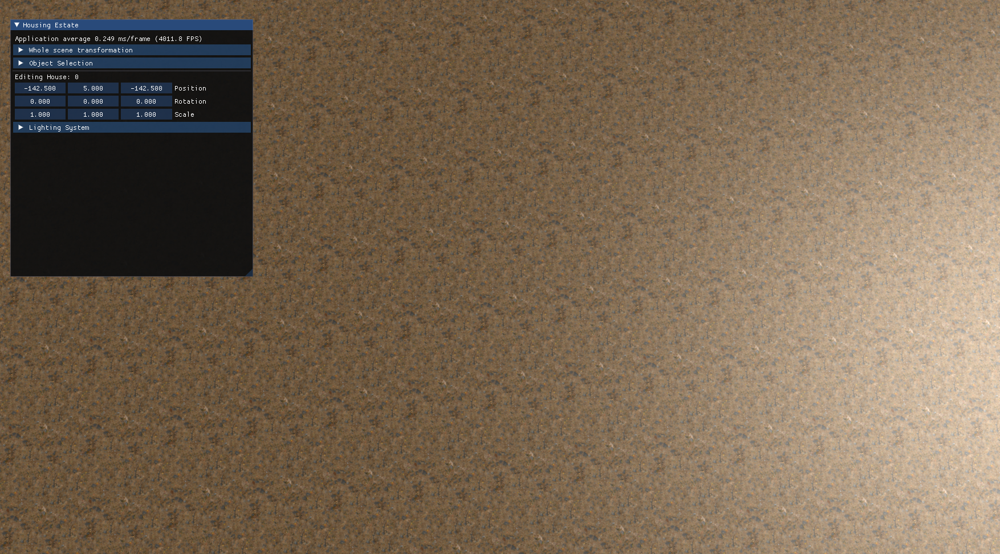

[](https://classroom.github.com/a/O5bR1qTQ)
[](../../actions)

# OpenGLGP

An OpenGL/CMake course project with several small scenes and shared rendering utilities.

## Included scenes

- `Triangle`
- `Sierpinski`
- `Solar System`
- `Housing Estate`
- `Interactive Scene`

When the app starts, it prints a console menu and asks you to choose a scene.

## Requirements

- CMake 3.21 or newer
- A C++ compiler supported by the project
- Git
- A CMake-capable IDE or terminal workflow

On Windows, enable `Developer Mode` so CMake can create the resources symlink.

## Build

```bash
cmake -B build
cmake --build build
```

## Run

```bash
./build/src/OpenGLGP
```

On Windows, run `build/src/OpenGLGP.exe`.

## Project layout

- `src/core` - shared engine-style code
- `src/apps` - scene implementations
- `thirdparty` - external dependencies
- `src/apps/*/res` - shaders, textures, and models


